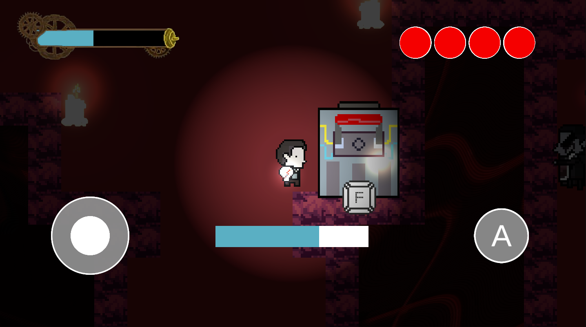
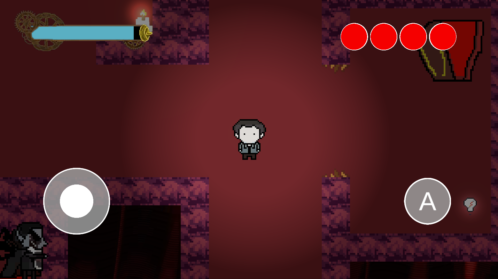
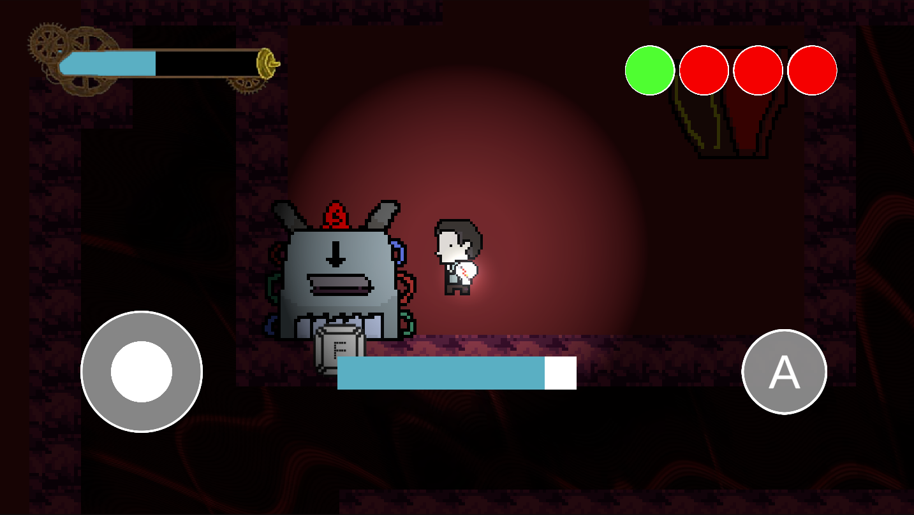
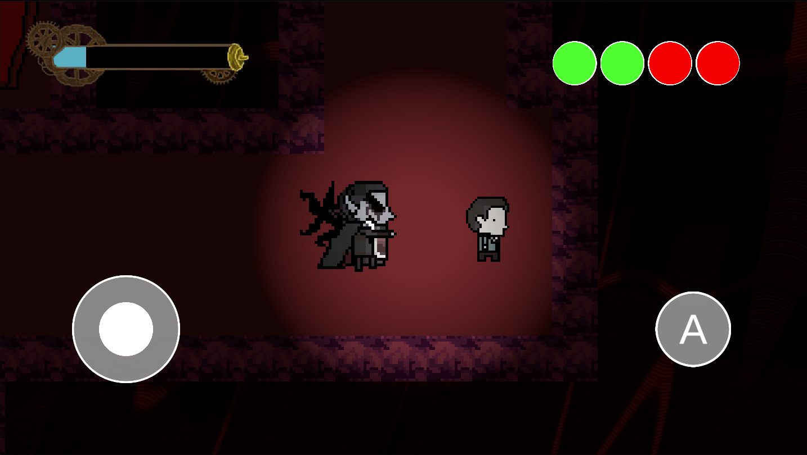

# 🧛‍♂️ Vamp's Neverland

A tense **resource management horror game** built in **Unity** for a [**SEA Game Jam 2024**](https://itch.io/jam/sea-game-jam-2024/rate/3001200), where your survival depends on how you spend your limited energy — light up your path, or power your escape?

---

## 🔧 Features

- 🎯 **Core Mechanic**: Choose between powering the **light generator** for visibility or the **door generators** to progress and escape.
- 🕯️ **Vision vs. Victory**:  
  - Powering **lights** gives you a larger field of view — crucial for avoiding danger.  
  - Powering **doors** brings you closer to escaping, but leaves you in the dark.
- 🧛 **Vampire AI**: A vampire roams the dungeon, hunting you in the shadows. Stay alert.
- 🕹️ **Strategic Gameplay**: Manage risk vs. reward with every resource collected.
- 🏃 **Goal**: Deposit enough energy into all **4 door generators** to open the exit and escape the dungeon alive.

---

## 🖼️ Screenshots

### Light Generator

### Light Up

### Door Generator  

### Boss

---

## ▶️ Play on Itch.io

  <a href="https://vinw79.itch.io/seateamj">
    
     
    <strong>🕹️ Click here to play Vamp's Neverland on Itch.io</strong>
  </a>

